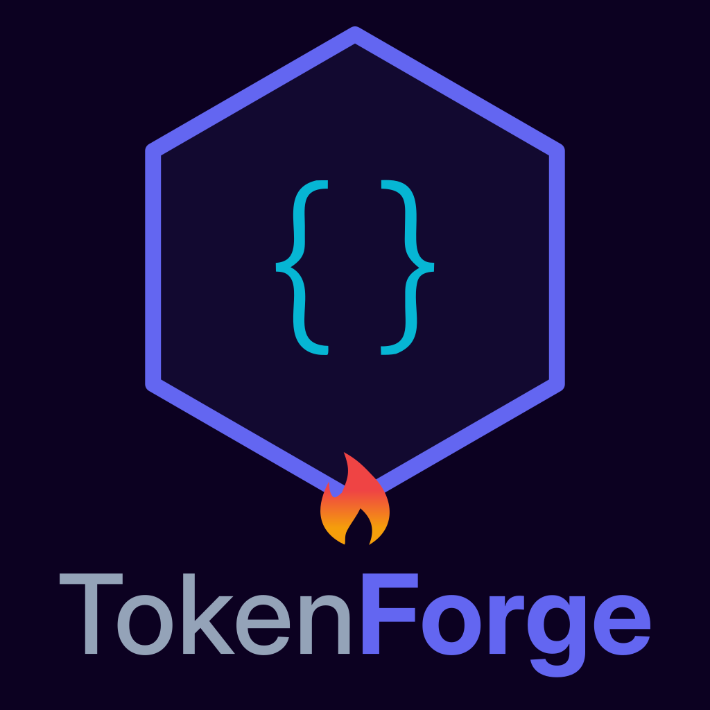
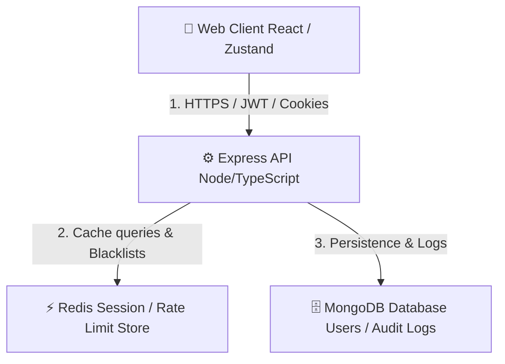

# TokenForge

<p align="center">
  
</p>

<p align="center">
  <b>Forge Your Auth. Own Every Token.</b>
</p>

<p align="center">
  <a href="https://github.com/logusivam/tokenforge/actions/workflows/ci.yml"></a>
  <a href="https://github.com/logusivam/tokenforge/security/code-scanning"></a>
  <a href="https://codecov.io/gh/logusivam/tokenforge"></a>
  <a href="LICENSE"></a>
  <a href="https://nodejs.org"></a>
  <a href="https://www.typescriptlang.org"></a>
</p>

---

## Live Demo

🔗 **Frontend**:
[tokenforge-dev.vercel.app](https://tokenforge-dev.vercel.app)  
🔗 **API Docs (Swagger)**:
[tokenforge-api-ecix.onrender.com/api/docs](https://tokenforge-api-ecix.onrender.com/api/docs)

---

<details>
<summary><b>❓ 1. What's the problem? (Click to expand)</b></summary>

Modern web applications depend heavily on black-box SaaS authorization providers
(e.g., Auth0, Clerk, Clerk SDKs) that hold user session data hostage, limit
local security controls, charge high rates for scale, and introduce external
network dependencies. Developers lose insight into how cryptographic keys,
rotation families, and role evaluations operate from first principles.
</details>

<details>
<summary><b>🛠️ 2. How it solves it (Click to expand)</b></summary>

**TokenForge** is an open-source, custom authentication engine built from
scratch. It puts full cryptographic authority back in the hands of the
developer. It acts as an on-premise, stateless token layer running on asymmetric
signature schemes (RS256) and memory-mapped cache databases. It provides token
generation, silent rotation tracking, and role verification directly inside your
own application borders.
</details>

<details>
<summary><b>✨ 3. Key features (Click to expand)</b></summary>

- 🔐 **JWT RS256** — Asymmetric private/public key signature verification.
- 🔄 **Refresh Token Rotation** — Sliding-window generation with reuse
  compromises invalidation tracking.
- 🛡️ **OAuth2 + PKCE** — Secure Google & GitHub authentication flow verifiers.
- 👥 **Fine-Grained RBAC** — Multi-role system resource mapping guards.
- ⚡ **Redis Cache Store** — Rate limit counters and revoked token blacklist
  tracking.
- 🗄️ **MongoDB database** — Active security event audit logs with automatic TTL
  purges.
- 🔒 **Security Hardening** — Helmet settings, CORS constraints, mongo
  sanitization.

</details>

<details>
<summary><b>📐 4. System Architecture Diagram (Click to expand)</b></summary>



</details>

<details>
<summary><b>📂 5. Project Directory Structure (Click to expand)</b></summary>

```
tokenforge/
├── apps/
│   ├── api/                    # TypeScript Express API Backend
│   │   ├── src/
│   │   │   ├── config/         # DB, Redis, Sentry, and Swagger setups
│   │   │   ├── middleware/     # Rate limiter, RBAC, Sanitization, Error handler
│   │   │   ├── modules/        # Auth, OAuth providers, Users, RBAC, Support, Token modules
│   │   │   ├── shared/         # Constants, custom logger, response utilities
│   │   │   └── server.ts       # Application bootstrap and server entry
│   │   ├── tests/              # Unit & Integration test suites
│   │   ├── package.json
│   │   └── tsconfig.json
│   └── web/                    # React Vite SPA Frontend
│       ├── public/             # Static assets (Favicons, Logo, robots.txt, sitemap.xml, security.txt)
│       ├── src/
│       │   ├── components/     # UI forms, navigation layout, feedback widgets
│       │   ├── hooks/          # React hooks (useAuth, etc.)
│       │   ├── pages/          # Auth, Login, Dashboard, Admin, Profile pages
│       │   ├── router/         # ProtectedRoutes and react-router tree
│       │   ├── services/       # Axios API client handlers
│       │   ├── store/          # Zustand global auth state management
│       │   └── main.tsx        # React client entry point
│       ├── package.json
│       ├── tailwind.config.js
│       └── vite.config.ts
├── packages/                   # Shared Monorepo workspaces / helper utilities
├── docus/                      # Architecture and system documentation
├── docker-compose.yml          # Local database orchestrations (MongoDB & Redis)
└── package.json                # Monorepo workspace configuration
```

</details>

<details>
<summary><b>🔄 6. How it works flow (Click to expand)</b></summary>

1. **Registration**: User accounts are created, hashes are computed locally via
   `bcryptjs` (salt factor 12), and identities are persisted in MongoDB.
2. **Access Token Generation**: The API signs a JWT payload with an asymmetric
   private key using the RS256 algorithm.
3. **Session Verification**: Client applications verify JWT authenticity using
   the distributable public key.
4. **Silent Refresh Rotation**: When access tokens expire (15-minute window),
   client middleware interceptors exchange refresh tokens via secure httpOnly
   cookies.
5. **RBAC Rules Enforcement**: Decoded JWT claims are parsed directly at the
   middleware layer to verify route permissions.

</details>

<details>
<summary><b>📋 7. Runtime requirements (Click to expand)</b></summary>

- **Node.js**: `v22.0.0` or higher
- **NPM**: `v10.0.0` or higher
- **Databases**: MongoDB v8.0+ and Redis v7.0+ (running locally or via Docker)

</details>

<details>
<summary><b>🚀 8. Install & Setup guide (Click to expand)</b></summary>

```bash
# Clone the repository
git clone https://github.com/logusivam/tokenforge.git
cd tokenforge

# Install workspaces dependencies
npm install

# Generate cryptographic keys
npm run keys:generate

# Spin up local database containers
npm run docker:up

# Run local dev environment
npm run dev
```

</details>

<details>
<summary><b>🧪 9. Testing setup (Click to expand)</b></summary>

```bash
# Run unit and integration test suites
npm run test

# Run Playwright E2E suites
npm run test:e2e
```

</details>

<details>
<summary><b>📦 10. Release notes (Click to expand)</b></summary>

Releases are managed using `semantic-release` configurations linked to
conventional commit history scopes (`feat`, `fix`, `docs`, `config`) to
automatically update changelogs.
</details>

<details>
<summary><b>⚠️ 11. Security Disclaimer (Click to expand)</b></summary>

This is an educational reference implementation demonstrating secure
authentication principles. Before deploying to high-traffic production
workloads, audit key storage structures and review rate limiting thresholds.
</details>

<details>
<summary><b>⚖️ 12. MIT License (Click to expand)</b></summary>

Released under the [MIT License](LICENSE).
</details>

<details>
<summary><b>✍️ 13. Credits (Click to expand)</b></summary>

- **Lead Architect**: Developed by
  [Loganathan G P (Logusivam Vision)](https://loganathangp-dev-portfolio.vercel.app/)
- Open source libraries used: Express, React, Mongoose, ioredis, TanStack Query,
  Zustand, Framer Motion.

</details>
